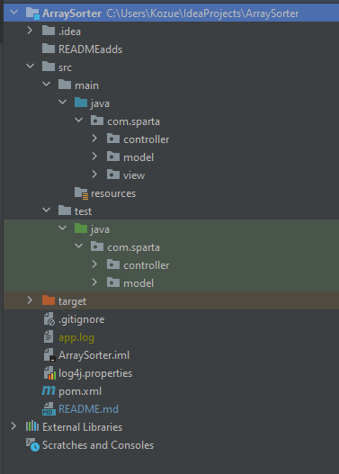
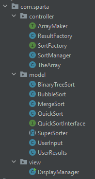
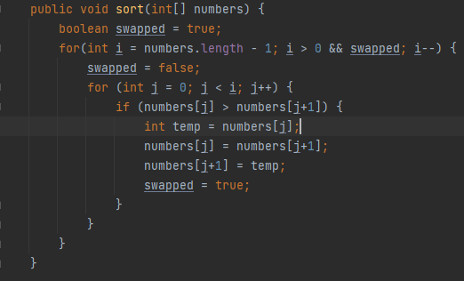
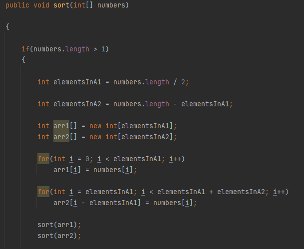
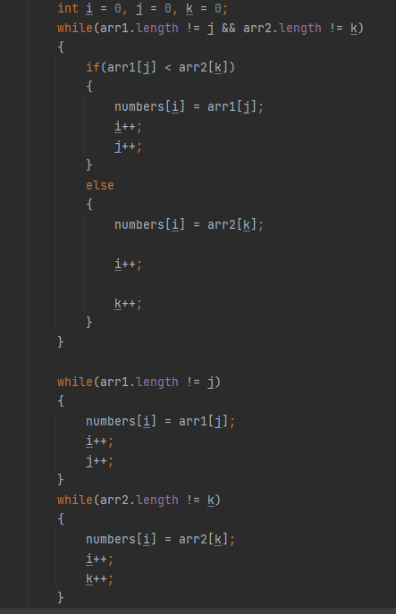
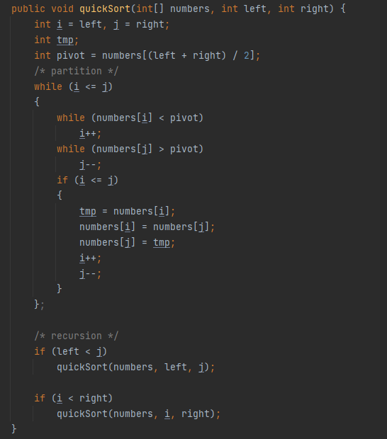
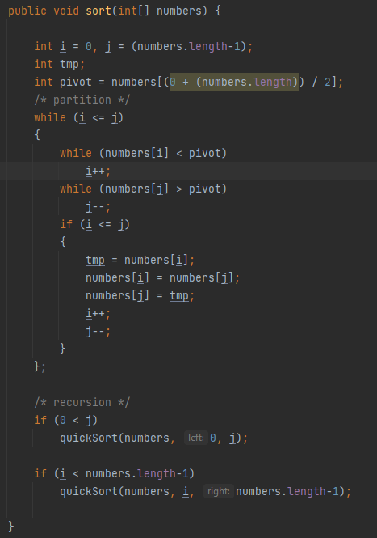

# `Java` Array Sorter Readme

Provided is a small implementation of a program that sorts arrays. A user is given the ability to choose a sorting method and provide the length of the array to be sorted. Currently the application only sorts arrays of `int`, but further additions can extended this functionality to include other data types.

---

 ### Table of Contents :
 - ##### Program Structure
 - ##### Bubble Sort
 - ##### Merge Sort
 - ##### Quick Sort
 - ##### Binary Tree Sort
 - ##### Array Maker
 - ##### Sort Manager
 - ##### Results Factory
 - ##### Display Manager
 - ##### Testing
 - ##### Future Additions

 ---

## Program Structure
The application uses **_Maven_** to manage the products build. **_log4j_** for logging and **_JUnit_** for testing classes and methods. MVC design considerations have also been employed to split the code base into three(3) packages and their corresponding classes.

__File Structure__

__Classes__

 ---

## Bubble Sort
Bubble Sort works by comparing two adjacent elements in the array. If these elements are out of order they are swapped. This continues until the largest number reaches the end of the array. The next largest number is searched for and a similar process resumes until the array is sorted.

__Bubble Sort Algorithm__

---

## Merge Sort
Merge Sort works by repeatedly breaking down the list of numbers into small sublists until each sublist consists of a single element. Pairs of elements are then compared, placed into order and combined. This process is resumed until the list is whole again and sorted.

__Merge Sort Algorithm__

---

## Quick Sort
Quick Sort works by breaking an array into two smaller arrays. One holding values smaller than a specified value the "pivot" and the other holding values greater than the "pivot". The sort then calls itself recursively to sort the two results sub-arrays.

__Quick Sort Algorithm__

---

## Binary Tree Sort
