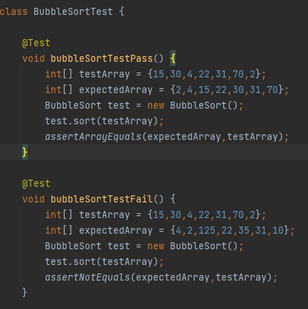

# `Java` Array Sorter Readme

Provided is a small implementation of a program that sorts arrays. A user is given the ability to choose a sorting method and provide the length of the array to be sorted. Currently the application only sorts arrays of `int`, but further additions can extended this functionality to include other data types.

---

 ### Table of Contents :
 - ##### Program Structure
 - ##### Bubble Sort
 - ##### Merge Sort
 - ##### Quick Sort
 - ##### Binary Tree Sort
 - ##### Testing
 - ##### Future Additions

 ---

## Program Structure
The application uses **_Maven_** to manage the products build. **_log4j_** for logging and **_JUnit_** for testing classes and methods. MVC design considerations have also been employed to split the code base into three(3) packages and their corresponding classes.

__File Structure__

__Classes__

 ---

## Bubble Sort
Bubble Sort works by comparing two adjacent elements in the array. If these elements are out of order they are swapped. This continues until the largest number reaches the end of the array. The next largest number is searched for and a similar process resumes until the array is sorted.

__Bubble Sort Algorithm__

---

## Merge Sort
Merge Sort works by repeatedly breaking down the list of numbers into small sublists until each sublist consists of a single element. Pairs of elements are then compared, placed into order and combined. This process is resumed until the list is whole again and sorted.

__Merge Sort Algorithm__

---

## Quick Sort
Quick Sort works by breaking an array into two smaller arrays. One holding values smaller than a specified value the "pivot" and the other holding values greater than the "pivot". The sort then calls itself recursively to sort the two results sub-arrays.

__Quick Sort Algorithm__

---

## Binary Tree Sort

A Binary Tree is a tree data structure made up of nodes that contain data and pointers to other nodes.
Nodes can have at most pointers to two(2) other nodes or null. A root node is assigned and based on the value of the next Node the next Node is either placed to left or right pointer of the previous node. Left for data that is lower in comparative order, right for those that are larger. This comparison starts at the root and continues until the tree is populated.

For the sort to work the populated tree is then traversed over starting at the first left node and traversing left to right storing each value as you move node to node. This is due to this order of traversal matching the same order as if the array was sorted.

---

Other README algorithm additions to be made later.

---

## Testing

__Bubble Sort Test Example__

---

##  Future Additions

- Insertion Sorter.
- A GUI.
- Library sorting for comparison making use of `Collections.sort(), Arrays.sort() and Arrays.parallelSort()`.
- Generics so users can sort types and objects other than `int`.
